# Portfolio | Beginner Python Developer

## Education
- Secondary school: Specialized school №4 with in-depth study of individual subjects

## Projects
### Desktop Translator Application
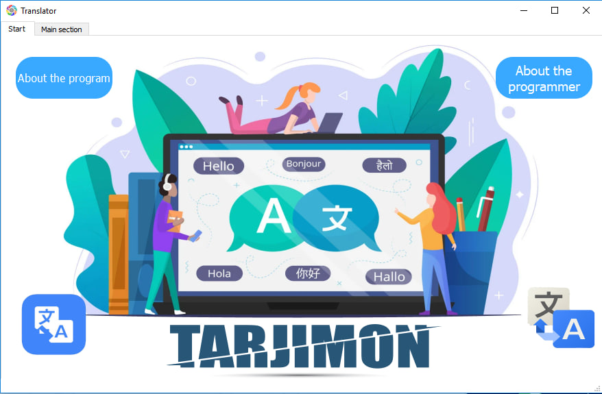
Created a desktop translator program with a very user-friendly interface.
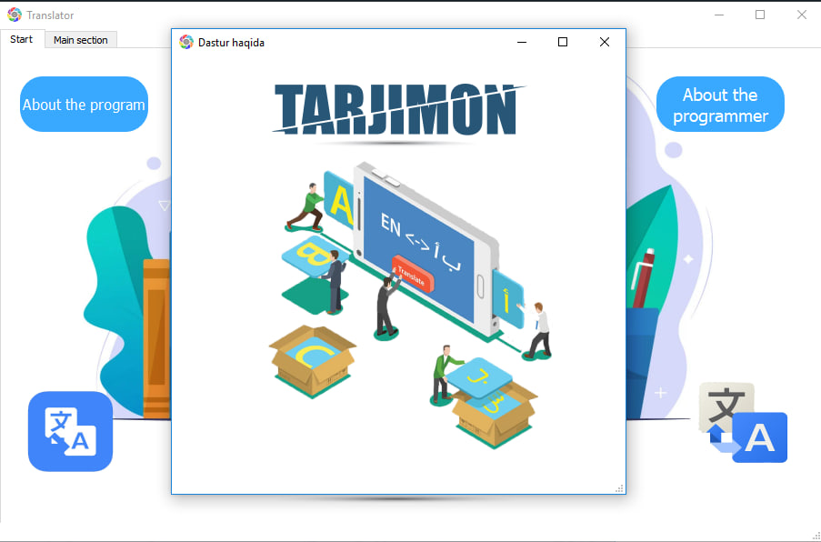
The program can help you with translating texts in a lot of languages, including but not limited to English, Ukrainian, Arabic, and Uzbek. 

It also contains links to my(developer's) social media accounts in the "About the developer" section. Feel free to use them if you wish to contact me.
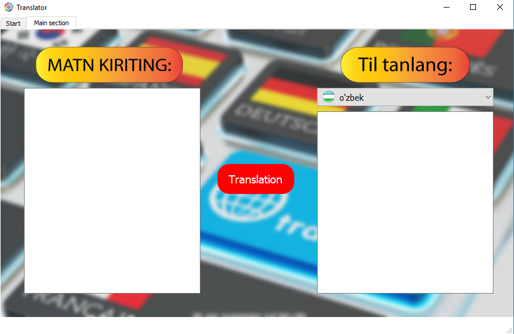
### Desktop Document Converter
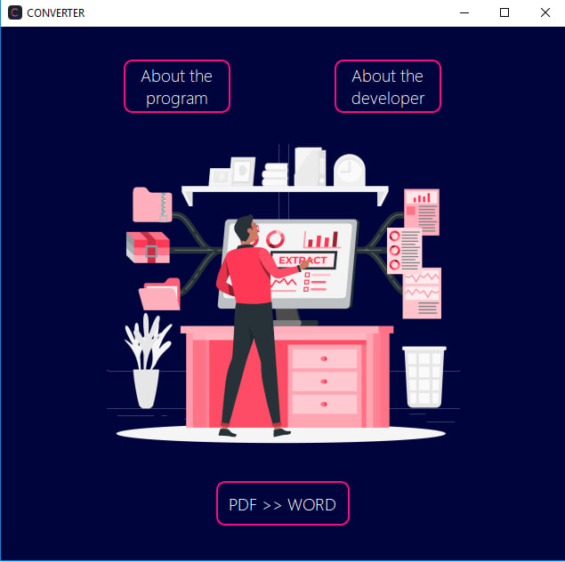
Created a program to convert documents from .pdf type to .docx format.

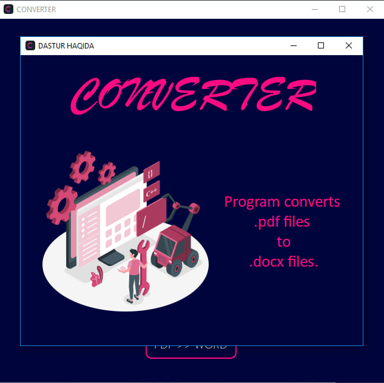

It works offline, so any user can use it whenever they want no matter their internet connection.

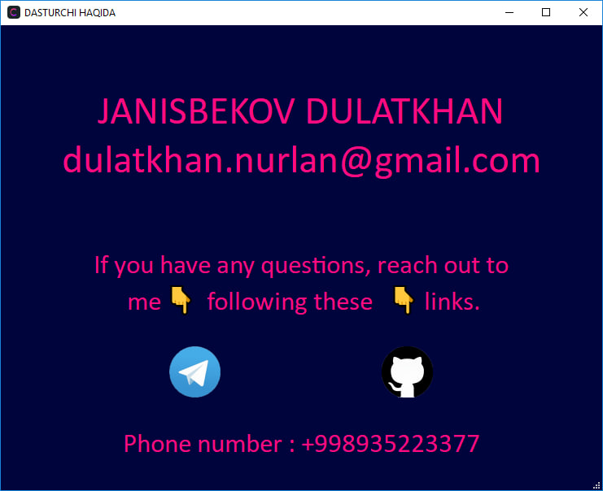

It also provides my email address as well as links to my social media accounts.

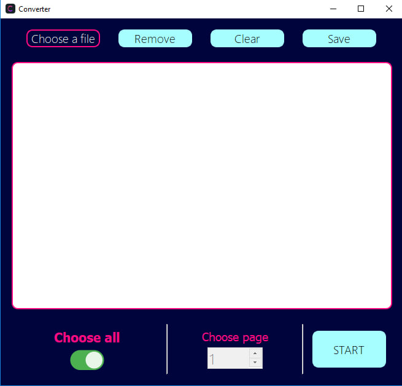

# Progamming Experience in other fields
I have completed a lot of courses based on two programming languages: Java and C++. 
##Courses
###Android Development Track

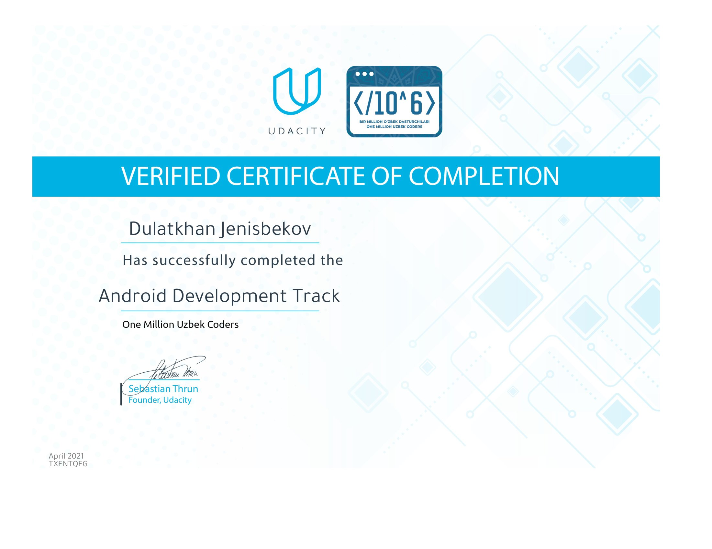
###Data Science Math Skills
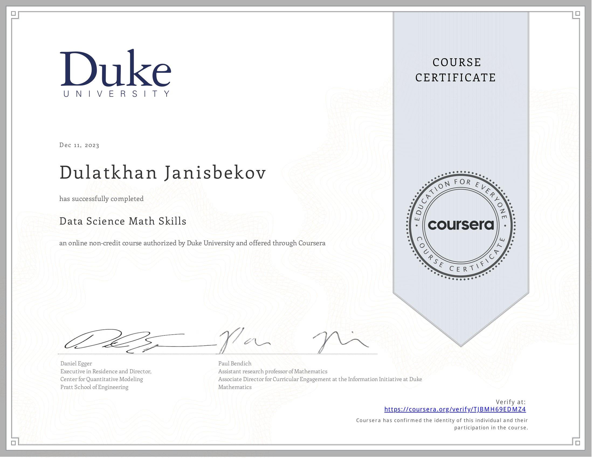
###Java Foundations
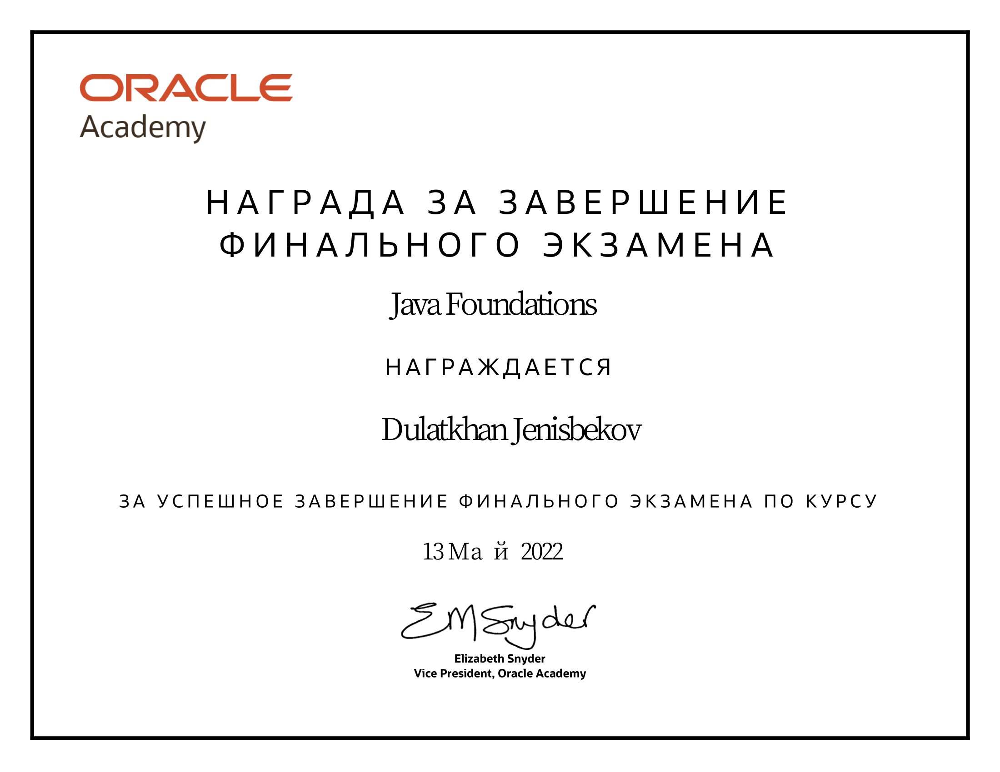
###Java. Quick Start
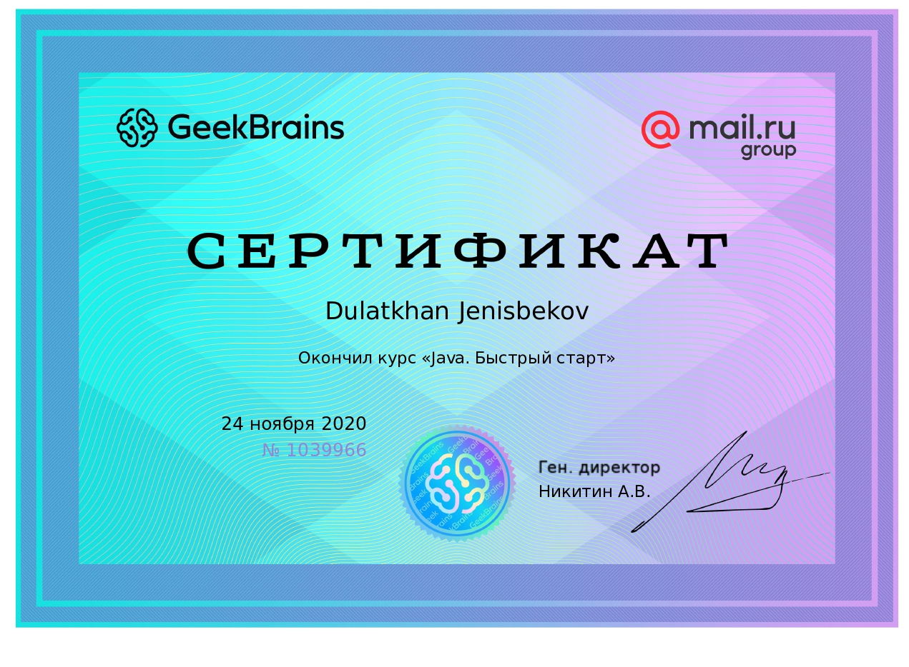
###Java for beginners. Intensive

###Career in Android: from choosing a course to senior developer.
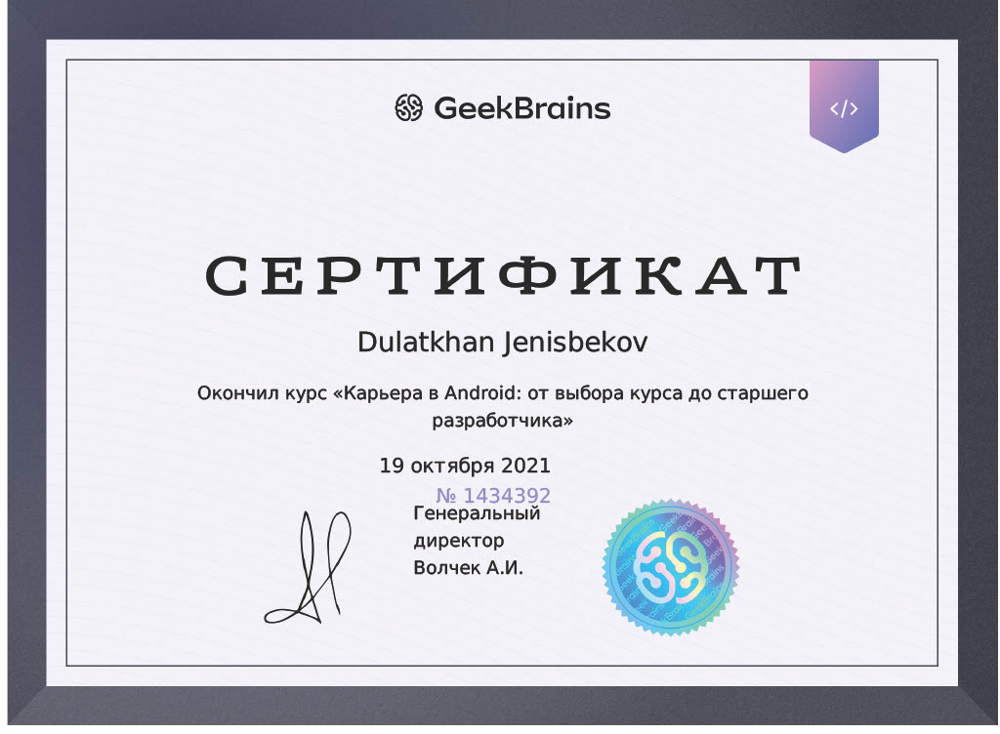
